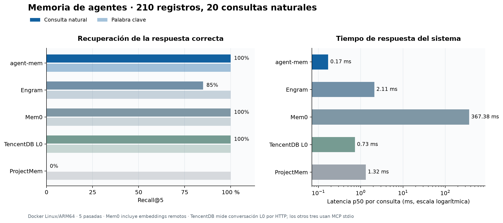

# Resultados comparativos: recuperación de memorias

Medición en Docker Linux/ARM64 con los cinco proyectos reales y las revisiones
fijadas en [README.md](README.md). Corpus controlado de 210 registros: diez hechos
con respuesta conocida y 200 distractores. La evaluación utiliza 20 consultas
naturales y diez consultas por palabra clave. Recall@5 y MRR@5 se calculan sobre
la primera pasada; p50 y p95 usan cinco pasadas (100/50 muestras). Las versiones,
entradas, respuestas individuales y tiempos están en [results/](results/).

| Producto | Recall@5 natural | MRR@5 natural | Consulta natural p50 | p95 | Carga de 210 registros |
|---|---:|---:|---:|---:|---:|
| **agent-mem** | **20/20** | **1,000** | **0,17 ms** | **0,71 ms** | **0,06 s** |
| Engram | 17/20 | 0,850 | 2,11 ms | 4,02 ms | 0,80 s |
| Mem0 OSS | 20/20 | 1,000 | 367,38 ms | 892,62 ms | 99,41 s |
| TencentDB L0 | 20/20 | 0,975 | 0,73 ms | 1,59 ms | 1,25 s |
| ProjectMem | 0/20 | 0,000 | 1,32 ms | 1,42 ms | 0,50 s |

Los cinco alcanzaron 10/10 en el perfil de palabras clave. ProjectMem busca
subcadenas literales; sus cero aciertos en frases reformuladas describen esa
interfaz, no un fallo de almacenamiento. Mem0 empleó embeddings remotos de
OpenAI, incluidos en sus tiempos; los otros perfiles no hicieron llamadas
remotas durante la búsqueda. TencentDB midió conversación L0 con extracción
desactivada. Los otros tres productos usaron MCP stdio y TencentDB HTTP local.

agent-mem fue el más rápido en esta configuración y empató con Mem0 en
recuperación de respuestas conocidas. Las 20 consultas no prueban superioridad
general en eficacia ni éxito en tareas de programación. Para eso hay que ejecutar
la [matriz Harbor](../README.md) con el mismo agente, modelo y tareas para cada
integración, y añadir casos de paráfrasis difíciles, contradicciones y cambios
temporales. Este resultado se limita a memoria suministrada y búsqueda.

